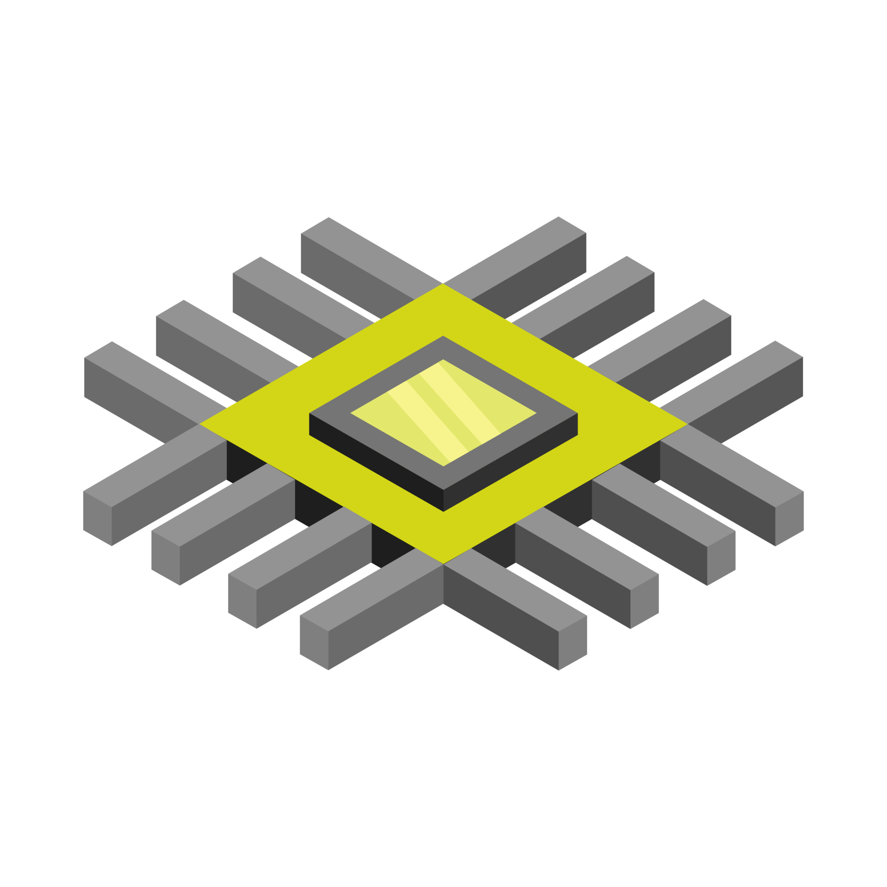

# CASCODE-LABS

{ align=left }

Cascode-labs is developing analog & RF IP designs for open-source hardware
integrated circuits. (OSHIC)  We also support a set of tools for the
designinging these IP blocks.

## Goals

- Design a basic set of analog and RF IP
- Improve analog & RF IP reuse
- Improve IP simulation and lab testing
  - Improve communication of results
  - Improve coverage
  - Enable process-independent test benches
- Encourage collaboration among designers with an interest in
  design automation
- Lower the barrier to entry for analog and RF design engineers
- Develop analog and RF IC generators that can produce IP in multiple
processes and adjust to variations in specifications.
- Accelerate designer productivity

## Projects

- [Viper](http://www.cascode-labs.org/viper/) IC design Environment
  - Simulation Testing Environment
  - Devcontainer EDA Environment
  - Project Management
  - IP Management
- [Viper-forge](http://www.cascode-labs.org/viper-forge/) community-led 
  packages of integrated circuit IP and design tools.
- [Virtue](http://www.cascode-labs.org/virtue/) Cadence Virtuoso SKILL and
Python framework for easily integrating automated design projects into
Virtuoso.

## Related Organizations

- [MOSAIC](https://www.mosaic-ic.org/)
